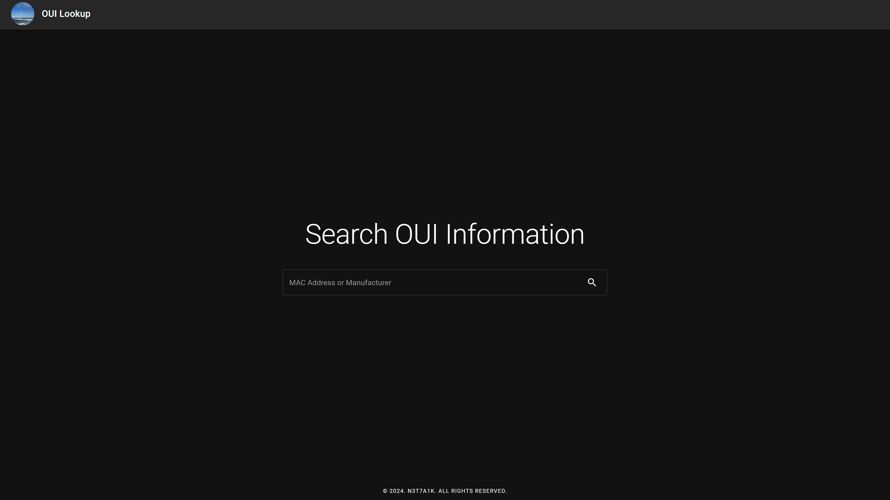

# OUI Lookup Service
## Introduction
This web service allows users to easily search and retrieve OUI (Organizationally Unique Identifier) information based on MAC addresses or manufacturer names.



## Environment Variable
You MUST set base URL of the API before running the server.
```
API_BASE_URL=https://ouiapi.n3t7a1k.io
```

